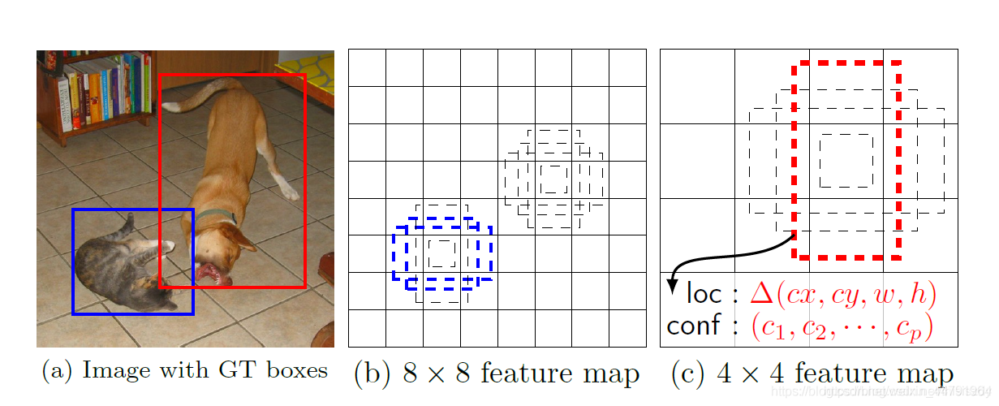

# EfficientNet


## 深度 宽度 图片大小


## 同时改变深度,宽度,图片大小能提高准确率


# 源码下载

https://github.com/bubbliiiing/efficientdet-pytorch
 喜欢的可以点个star噢。


# Efficientdet实现思路

## 一、预测部分

### 1、主干网络介绍


> 左侧为特征提取
>
> **P3 P4 P5 是EfficientNet中提取的,P6 P7是后面添加的**
>
> 中间绿框为加强特征提取,由**一系列BiFPN层(粉框)**构成
>
> ​    **BiFPN会对特征进行上采样的特征融合(从上到下箭头),再进行下采样特征融合(从上到下箭头)**
>
> ​	D0重复3次,依次增加
>
> 右侧为预测分支,分为Class和Box预测


> Efficientdet采用Efficientnet作为主干[特征提取](https://so.csdn.net/so/search?q=特征提取)网络。EfficientNet-B0对应Efficientdet-D0；EfficientNet-B1对应Efficientdet-D1；以此类推。
>
> P1是长宽压缩1倍的结果,P2是长宽压缩2倍的结果,P3是长宽压缩3倍的结果

> EfficientNet模型具有很独特的特点，这个特点是参考其它优秀神经网络设计出来的。经典的神经网络特点如下：

1、**利用残差神经网络增大神经网络的深度，通过更深的神经网络实现特征提取。**
 2、**改变每一层提取的特征层数，实现更多层的特征提取，得到更多的特征，提升宽度。**
 3、**通过增大输入图片的分辨率也可以使得网络可以学习与表达的东西更加丰富，有利于提高精确度**。

> EfficientNet就是将这三个特点结合起来，通过一起**缩放baseline模型**（**MobileNet中就通过缩放α实现缩放模型，不同的α有不同的模型精度，α=1时为baseline模型；ResNet其实也是有一个baseline模型，在baseline的基础上通过改变图片的深度实现不同的模型实现**），同时调整**深度**、**宽度**、**输入图片的分辨率**完成一个优秀的网络设计。

在EfficientNet模型中，其使用一组固定的缩放系数统一缩放网络深度、宽度和分辨率。

> **假设想使用 $2^N$ 倍的计算资源，我们可以简单的对网络深度扩大 $α^N$ 倍、宽度扩大 $β^N$ 、图像尺寸扩大 $γ^N$ 倍，这里的α,β,γ都是由原来的小模型上做微小的网格搜索决定的常量系数。**
>
> 如图为EfficientNet的设计思路，从三个方面同时拓充网络的特性。


1

> 本博客以Efficientnet-B0和Efficientdet-D0为例，进行Efficientdet的解析。
>
> Efficientnet-B0由1个Stem+16个大Blocks堆叠构成，16个大Blocks可以分为1、2、2、3、3、4、1个Block。**Block的通用结构如下，其总体的设计思路是Inverted residuals结构和残差结构，在3x3或者5x5网络结构前利用1x1卷积升维，在3x3或者5x5网络结构后增加了一个关于通道的注意力机制，最后利用1x1卷积降维后增加一个大残差边。**


> 整体结构如下：
>
> **P3 P4 P5 是EfficientNet中提取的,P6 P7是后面添加的**


### 2、BiFPN加强特征提取

> P1 下采样1次
>
> P2 下采样2次
>
> P3 下采样3次
>
> P4 下采样4次
>
> P5 下采样5次
>
> P6 下采样6次
>
> P7 下采样7次
>
> ----
>
> 注意: BiFPN中
>
> P7_in和P6_in只有一个
>
> P4_in,P5_in分为 1 和 2,通过p4,p5调整通道得来
>
> P3_in也只有一个,通过p3调整通道得来


> BiFPN简单来讲是**一个加强版本的FPN，上图是BiFPN，下图是普通的FPN，大家可以看到，与普通的FPN相比，BiFPN的FPN构建更加复杂**，中间还增加了许多连接。


> 构建BiFPN可以分为多步：

1、**获得P3_in、P4_in、P5_in、P6_in、P7_in**，通过主干特征提取网络，我们已经可以**获得P3、P4、P5**，还需要**进行两次下采样获得P6、P7**。**P3、P4、P5在经过1x1卷积调整通道数后**，就可以作为**P3_in、P4_in、P5_in了**，在构建BiFPN的第一步，需要**构建两个P4_in、P5_in**（原版是这样设计的）。


> nets/efficientdet.py

```python
p3_in   = self.p3_down_channel(p3)
p4_in_1 = self.p4_down_channel(p4)
p5_in_1 = self.p5_down_channel(p5)
p4_in_2 = self.p4_down_channel_2(p4)
p5_in_2 = self.p5_down_channel_2(p5)
p6_in   = self.p5_to_p6(p5)
p7_in   = self.p6_to_p7(p6_in)
```

2、**在获得P3_in、P4_in_1、P4_in_2、P5_in_1、P5_in_2、P6_in、P7_in**之后需要对**P7_in进行上采样，上采样后与P6_in堆叠获得P6_td**；之后对**P6_td进行上采样，上采样后与P5_in_1进行堆叠获得P5_td**；之后对**P5_td进行上采样，上采样后与P4_in_1进行堆叠获得P4_td**；之后对**P4_td进行上采样，上采样后与P3_in进行堆叠获得P3_out**。


> nets/efficientdet.py

```python
"""下面四次上采样特征融合,图中由上到下"""
# 简单的注意力机制，用于确定更关注p7_in还是p6_in
p6_w1  = self.p6_w1_relu(self.p6_w1)
weight = p6_w1 / (torch.sum(p6_w1, dim=0) + self.epsilon)
# p6_in * 权重 + p7_in上采样 * 权重, 最后DW+PW卷积,获得p6_td
p6_td  = self.conv6_up(self.swish(weight[0] * p6_in + weight[1] * self.p6_upsample(p7_in)))

# 简单的注意力机制，用于确定更关注p6_up还是p5_in        P5_in分为 1 和 2
p5_w1  = self.p5_w1_relu(self.p5_w1)
weight = p5_w1 / (torch.sum(p5_w1, dim=0) + self.epsilon)
# p5_in_1 * 权重 + p6_td上采样 * 权重, 最后DW+PW卷积,获得p5_td
p5_td  = self.conv5_up(self.swish(weight[0] * p5_in_1 + weight[1] * self.p5_upsample(p6_td)))

# 简单的注意力机制，用于确定更关注p5_up还是p4_in        P4_in分为 1 和 2
p4_w1  = self.p4_w1_relu(self.p4_w1)
weight = p4_w1 / (torch.sum(p4_w1, dim=0) + self.epsilon)
# p4_in_1 * 权重 + p5_td上采样 * 权重, 最后DW+PW卷积,获得p4_td
p4_td  = self.conv4_up(self.swish(weight[0] * p4_in_1 + weight[1] * self.p4_upsample(p5_td)))

# 简单的注意力机制，用于确定更关注p4_up还是p3_in
p3_w1  = self.p3_w1_relu(self.p3_w1)
weight = p3_w1 / (torch.sum(p3_w1, dim=0) + self.epsilon)
# p3_in * 权重 + p4_td上采样 * 权重, 最后DW+PW卷积,获得p3_out
p3_out = self.conv3_up(self.swish(weight[0] * p3_in + weight[1] * self.p3_upsample(p4_td)))
```

3、在**获得P3_out、P4_td、P4_in_2、P5_td、P5_in_2、P6_in、P6_td、P7_in之后**，之后需要对**P3_out进行下采样，下采样后与P4_td、P4_in_2堆叠获得P4_out**；之后对**P4_out进行下采样，下采样后与P5_td、P5_in_2进行堆叠获得P5_out**；之后对**P5_out进行下采样，下采样后与P6_in、P6_td进行堆叠获得P6_out**；之后对**P6_out进行下采样，下采样后与P7_in进行堆叠获得P7_out**。


> nets/efficientdet.py

```python
"""下面四次下采样特征融合,图中由下到上"""
# 简单的注意力机制，用于确定更关注p4_in_2还是p4_up还是p3_out        P4_inn分为 1 和 2
p4_w2  = self.p4_w2_relu(self.p4_w2)
weight = p4_w2 / (torch.sum(p4_w2, dim=0) + self.epsilon)
# p4_in_2 * 权重 + p4_td * 权重 + p3_out下采样 * 权重, 最后DW+PW卷积,获得p4_out
p4_out = self.conv4_down(
    self.swish(weight[0] * p4_in_2 + weight[1] * p4_td + weight[2] * self.p4_downsample(p3_out)))

# 简单的注意力机制，用于确定更关注p5_in_2还是p5_up还是p4_out        P5_in分为 1 和 2
p5_w2  = self.p5_w2_relu(self.p5_w2)
weight = p5_w2 / (torch.sum(p5_w2, dim=0) + self.epsilon)
# p5_in_2 * 权重 + p5_td * 权重 + p4_out下采样 * 权重, 最后DW+PW卷积,获得p5_out
p5_out = self.conv5_down(
    self.swish(weight[0] * p5_in_2 + weight[1] * p5_td + weight[2] * self.p5_downsample(p4_out)))

# 简单的注意力机制，用于确定更关注p6_in还是p6_up还是p5_out
p6_w2  = self.p6_w2_relu(self.p6_w2)
weight = p6_w2 / (torch.sum(p6_w2, dim=0) + self.epsilon)
# p6_in * 权重 + p6_td * 权重 + p5_out下采样 * 权重, 最后DW+PW卷积,获得p6_out
p6_out = self.conv6_down(
    self.swish(weight[0] * p6_in + weight[1] * p6_td + weight[2] * self.p6_downsample(p5_out)))

# 简单的注意力机制，用于确定更关注p7_in还是p7_up还是p6_out
p7_w2  = self.p7_w2_relu(self.p7_w2)
weight = p7_w2 / (torch.sum(p7_w2, dim=0) + self.epsilon)
# p7_in * 权重 + p6_out下采样 * 权重, 最后DW+PW卷积,获得p7_out
p7_out = self.conv7_down(
    self.swish(weight[0] * p7_in + weight[1] * self.p7_downsample(p6_out)))
```

4、将获得的**P3_out、P4_out、P5_out、P6_out、P7_out作为P3_in、P4_in、P5_in、P6_in、P7_in**，**重复2、3步骤进行堆叠即可，对于Effiicientdet B0来讲，还需要重复2次，需要注意P4_in_1和P4_in_2此时不需要分开了，P5也是**。


> nets/efficientdet.py

```python
"""下面四次上采样特征融合,图中由上到下"""
# 简单的注意力机制，用于确定更关注p7_in还是p6_in
p6_w1  = self.p6_w1_relu(self.p6_w1)
weight = p6_w1 / (torch.sum(p6_w1, dim=0) + self.epsilon)
# p6_in * 权重 + p7_in上采样 * 权重, 最后DW+PW卷积,获得p6_td
p6_td  = self.conv6_up(self.swish(weight[0] * p6_in + weight[1] * self.p6_upsample(p7_in)))

# 简单的注意力机制，用于确定更关注p6_up还是p5_in
p5_w1  = self.p5_w1_relu(self.p5_w1)
weight = p5_w1 / (torch.sum(p5_w1, dim=0) + self.epsilon)
# p5_in* 权重 + p6_td上采样 * 权重, 最后DW+PW卷积,获得p5_td
p5_td  = self.conv5_up(self.swish(weight[0] * p5_in + weight[1] * self.p5_upsample(p6_td)))

# 简单的注意力机制，用于确定更关注p5_up还是p4_in
p4_w1  = self.p4_w1_relu(self.p4_w1)
weight = p4_w1 / (torch.sum(p4_w1, dim=0) + self.epsilon)
# p4_in * 权重 + p5_td上采样 * 权重, 最后DW+PW卷积,获得p4_td
p4_td  = self.conv4_up(self.swish(weight[0] * p4_in + weight[1] * self.p4_upsample(p5_td)))

# 简单的注意力机制，用于确定更关注p4_up还是p3_in
p3_w1  = self.p3_w1_relu(self.p3_w1)
weight = p3_w1 / (torch.sum(p3_w1, dim=0) + self.epsilon)
# p3_in * 权重 + p4_td上采样 * 权重, 最后DW+PW卷积,获得p3_out
p3_out = self.conv3_up(self.swish(weight[0] * p3_in + weight[1] * self.p3_upsample(p4_td)))


"""下面四次下采样特征融合,图中由下到上"""
# 简单的注意力机制，用于确定更关注p4_in还是p4_up还是p3_out
p4_w2  = self.p4_w2_relu(self.p4_w2)
weight = p4_w2 / (torch.sum(p4_w2, dim=0) + self.epsilon)
# p4_in * 权重 + p4_td * 权重 + p3_out下采样 * 权重, 最后DW+PW卷积,获得p4_out
p4_out = self.conv4_down(
    self.swish(weight[0] * p4_in + weight[1] * p4_td+ weight[2] * self.p4_downsample(p3_out)))

# 简单的注意力机制，用于确定更关注p5_in还是p5_up还是p4_out
p5_w2  = self.p5_w2_relu(self.p5_w2)
weight = p5_w2 / (torch.sum(p5_w2, dim=0) + self.epsilon)
# p5_in * 权重 + p5_td * 权重 + p4_out下采样 * 权重, 最后DW+PW卷积,获得p5_out
p5_out = self.conv5_down(
    self.swish(weight[0] * p5_in + weight[1] * p5_td+ weight[2] * self.p5_downsample(p4_out)))

# 简单的注意力机制，用于确定更关注p6_in还是p6_up还是p5_out
p6_w2  = self.p6_w2_relu(self.p6_w2)
weight = p6_w2 / (torch.sum(p6_w2, dim=0) + self.epsilon)
# p6_in * 权重 + p6_td * 权重 + p5_out下采样 * 权重, 最后DW+PW卷积,获得p6_out
p6_out = self.conv6_down(
    self.swish(weight[0] * p6_in + weight[1] * p6_td+ weight[2] * self.p6_downsample(p5_out)))

# 简单的注意力机制，用于确定更关注p7_in还是p7_up还是p6_out
p7_w2  = self.p7_w2_relu(self.p7_w2)
weight = p7_w2 / (torch.sum(p7_w2, dim=0) + self.epsilon)
# p7_in * 权重 + p6_out下采样 * 权重, 最后DW+PW卷积,获得p7_out
p7_out = self.conv7_down(self.swish(weight[0] * p7_in + weight[1] * self.p7_downsample(p6_out)))

```

### 3、从特征获取预测结果

通过第二部的重复运算，我们获得了P3_out, P4_out, P5_out, P6_out, P7_out。

为了和普通特征层区分，我们称之为**有效特征层**，将这五个有效的特征层传输过ClassNet+BoxNet就可以获得预测结果了。

对于Efficientdet-B0来讲：

> num_anchors = 9 每个框对应9个先验框

> **ClassNet采用3次64通道的卷积和1次num_anchors x num_classes的卷积，num_anchors指的是该特征层所拥有的先验框数量，num_classes指的是网络一共对多少类的目标进行检测。**

**BoxNet采用3次64通道的卷积和1次num_anchors x 4的卷积，num_anchors指的是该特征层所拥有的先验框数量，4指的是先验框的调整情况。**

需要注意的是，**每个特征层所用的ClassNet是同一个ClassNet；每个特征层所用的BoxNet是同一个BoxNet。**

其中：

**num_anchors x 4的卷积** 用于预测 **该特征层上** **每一个网格点上 每一个先验框**的变化情况。

**num_anchors x num_classes的卷积** 用于预测 **该特征层上** **每一个网格点上** **每一个预测框**对应的种类。

> nets/efficientdet.py

```python
"""
先验框预测
对上面BiFPN获得的5个有效特征层进行运算
5个有效特征层都使用同一个 BoxNet
5个有效特征层的卷积都是 conv_list,不过bn是不同的, bn_list 循环了5次
"""
class BoxNet(nn.Module):
    def __init__(self, in_channels, num_anchors, num_layers, onnx_export=False):
        super(BoxNet, self).__init__()
        self.num_layers = num_layers
        # 3深度可分离卷积特征融合 in_channels=64
        self.conv_list = nn.ModuleList(
            [SeparableConvBlock(in_channels, in_channels, norm=False, activation=False) for i in range(num_layers)])
        # 每一个有效特征层对应的Batchnor,5个特征层有5个bn列表
        self.bn_list = nn.ModuleList(
            [nn.ModuleList([nn.BatchNorm2d(in_channels, momentum=0.01, eps=1e-3) for i in range(num_layers)]) for j in range(5)])
        # 9 个先验框 4个参数 中心，宽高
        # 调整通道数,获得最后的分类 num_anchors = 9 * 4 = 36
        self.header = SeparableConvBlock(in_channels, num_anchors * 4, norm=False, activation=False)
        self.swish = MemoryEfficientSwish() if not onnx_export else Swish()

    def forward(self, inputs):
        """
        inputs: 5个特征层
        """
        feats = []
        # 对每个特征层循环(5个特征层的bn不同)
        for feat, bn_list in zip(inputs, self.bn_list):
            # 每个特征层需要进行num_layer次卷积+标准化+激活函数 5个特征层的卷积是相同的
            for i, bn, conv in zip(range(self.num_layers), bn_list, self.conv_list):
                feat = conv(feat)
                feat = bn(feat)
                feat = self.swish(feat)
            # [b, num_anchors*4, h, w]
            feat = self.header(feat)

            # [b, num_anchors*4, h, w] -> [b, h, w, num_anchors*4] 通道放到最后
            feat = feat.permute(0, 2, 3, 1)
            #                              b, 全部先验框, 先验框的4个参数    h*w表示网格总数,再乘以num_anchors就是全部先验框
            # [b, num_anchors*4, h, w] -> [b, h*w*num_anchors, 4]
            feat = feat.contiguous().view(feat.shape[0], -1, 4)

            feats.append(feat)
        # 进行一个堆叠
        feats = torch.cat(feats, dim=1)

        return feats

"""
类别预测
对上面BiFPN获得的5个有效特征层进行运算
5个有效特征层都使用同一个 ClassNet
5个有效特征层的卷积都是 conv_list,不过bn是不同的, bn_list 循环了5次
"""
class ClassNet(nn.Module):
    def __init__(self, in_channels, num_anchors, num_classes, num_layers, onnx_export=False):
        super(ClassNet, self).__init__()
        self.num_anchors = num_anchors
        self.num_classes = num_classes
        self.num_layers = num_layers
        # 3深度可分离卷积特征融合 in_channels=64
        self.conv_list  = nn.ModuleList(
            [SeparableConvBlock(in_channels, in_channels, norm=False, activation=False) for i in range(num_layers)])
        # 每一个有效特征层对应的Batchnor,5个特征层有5个bn列表
        self.bn_list = nn.ModuleList(
            [nn.ModuleList([nn.BatchNorm2d(in_channels, momentum=0.01, eps=1e-3) for i in range(num_layers)]) for j in range(5)])
        # 9 个先验框 num_classes
        self.header = SeparableConvBlock(in_channels, num_anchors * num_classes, norm=False, activation=False)
        self.swish = MemoryEfficientSwish() if not onnx_export else Swish()

    def forward(self, inputs):
        feats = []
        # 对每个特征层循环(5个特征层的bn不同)
        for feat, bn_list in zip(inputs, self.bn_list):
            # 每个特征层需要进行num_layer次卷积+标准化+激活函数 5个特征层的卷积是相同的
            for i, bn, conv in zip(range(self.num_layers), bn_list, self.conv_list):
                feat = conv(feat)
                feat = bn(feat)
                feat = self.swish(feat)
            # [b, 9*num_classes, h, w]
            feat = self.header(feat)

            # [b, 9*num_classes, h, w]  => [b, h, w, 9*num_classes]
            feat = feat.permute(0, 2, 3, 1)
            # [b, h, w, 9*num_classes]  => [b, h, w, 9, num_classes]
            feat = feat.contiguous().view(feat.shape[0], feat.shape[1], feat.shape[2], self.num_anchors, self.num_classes)
            #                              [b, 全部先验框, 分类数]     h*w表示网格总数,再乘以num_anchors就是全部先验框
            # [b, h, w, 9, num_classes] => [b, h*w*9, num_classes]
            feat = feat.contiguous().view(feat.shape[0], -1, self.num_classes)

            feats.append(feat)
        # 进行一个堆叠
        feats = torch.cat(feats, dim=1)
        # 取sigmoid表示概率
        feats = feats.sigmoid()

        return feats
```

### 4、预测结果的解码


> 我们通过对每一个特征层的处理，可以获得三个内容，分别是：
>
> **num_anchors x 4的卷积** 用于预测 **该特征层上** **每一个网格点上 每一个先验框**的变化情况。**
>
> **num_anchors x num_classes的卷积** 用于预测 **该特征层上** **每一个网格点上** **每一个预测框**对应的种类。
>
> 每一个有效特征层对应的先验框对应着**该特征层上** **每一个网格点上 预先设定好的9个框。**
>
> 我们利用 **num_anchors x 4的卷积** 与 **每一个有效特征层对应的先验框** 获得框的真实位置。
>
> 每一个有效特征层对应的先验框就是，如图所示的作用：
>
> 每一个有效特征层将整个图片分成与其长宽对应的网格，**如P3的特征层就是将整个图像分成64x64个网格；然后从每个网格中心建立9个先验框，一共64x64x9个，36864‬个先验框。**



先验框虽然可以代表一定的**框的位置信息与框的大小信息**，但是其是有限的，无法表示任意情况，因此还需要调整，Efficientdet利用**3次64通道的卷积+num_anchors x 4的卷积**的结果对先验框进行调整。

**num_anchors x 4中的num_anchors表示了这个网格点所包含的先验框数量，其中的4表示了框的左上角xy轴，右下角xy的调整情况。**

Efficientdet解码过程就是将对应的**先验框的左上角和右下角进行位置的调整，调整完的结果就是预测框的位置了。**

**当然得到最终的预测结构后还要进行得分排序与非极大抑制筛选这一部分基本上是所有目标检测通用的部分。**

**1、取出每一类得分大于confidence_threshold的框和得分。
 2、利用框的位置和得分进行非极大抑制。**

实现代码如下：

#### 生成先验框

> utils/anchors.py

````python
"""
先验框
9个
三个正方形,三个竖的长方形,三个横的长方形
"""


import itertools

import numpy as np
import torch
import torch.nn as nn

# 生成先验框, y1,x1,y2,x2
class Anchors(nn.Module):
    def __init__(self, anchor_scale=4., pyramid_levels=[3, 4, 5, 6, 7]):
        super().__init__()
        self.anchor_scale = anchor_scale
        self.pyramid_levels = pyramid_levels
        # stride = 原宽 / 特征宽
        # 512 / 64 = 8 以此类推
        # strides步长为[8, 16, 32, 64, 128]， 特征点的间距
        self.strides = [2 ** x for x in self.pyramid_levels]
        # scales,ratios长度都是3
        self.scales = np.array([2 ** 0, 2 ** (1.0 / 3.0), 2 ** (2.0 / 3.0)])
        self.ratios = [(1.0, 1.0), (1.4, 0.7), (0.7, 1.4)]

    def forward(self, image):
        image_shape = image.shape[2:]

        boxes_all = []
        # 循环步长,相当于对5个特征层进行循环
        for stride in self.strides:
            boxes_level = []
            # 组合scales和ratios进行循环
            for scale, ratio in itertools.product(self.scales, self.ratios):
                if image_shape[1] % stride != 0:
                    raise ValueError('input size must be divided by the stride.')
                # 计算先验框基础的边长
                base_anchor_size = self.anchor_scale * stride * scale
                anchor_size_x_2 = base_anchor_size * ratio[0] / 2.0
                anchor_size_y_2 = base_anchor_size * ratio[1] / 2.0

                # 计算每个网格点的xy左边
                x = np.arange(stride / 2, image_shape[1], stride)
                y = np.arange(stride / 2, image_shape[0], stride)
                # 组合坐标
                xv, yv = np.meshgrid(x, y)
                # 平铺
                xv = xv.reshape(-1)
                yv = yv.reshape(-1)

                # 先验框定义是左上角坐标和右下角坐标 y1,x1,y2,x2
                boxes = np.vstack((yv - anchor_size_y_2, xv - anchor_size_x_2,
                                   yv + anchor_size_y_2, xv + anchor_size_x_2))
                boxes = np.swapaxes(boxes, 0, 1)
                boxes_level.append(np.expand_dims(boxes, axis=1))
            # concat anchors on the same level to the reshape NxAx4
            boxes_level = np.concatenate(boxes_level, axis=1)
            boxes_all.append(boxes_level.reshape([-1, 4]))

        # 所有先验框进行堆叠
        anchor_boxes = np.vstack(boxes_all)

        anchor_boxes = torch.from_numpy(anchor_boxes).to(image.device)
        anchor_boxes = anchor_boxes.unsqueeze(0)

        return anchor_boxes
````

> utils/utils_bbox.py 利用预测值对先验框进行调整

```python
import numpy as np
import torch
from torchvision.ops import nms

"""利用预测结果调整先验框得到预测框"""
def decodebox(regression, anchors, input_shape):
    """
    regression: 回归预测结果   [b, h*w*num_anchors, 4]
                 先验框总数       中心和宽高参数
    anchors: 先验框            [b, h*w*num_anchors, 4]
    input_shape: 图片
    """
    dtype   = regression.dtype
    anchors = anchors.to(dtype)

    """将先验框形式由 左上角坐标+右下角坐标 形式转换为 中心+宽高 的形式"""
    #--------------------------------------#
    #   计算先验框的中心
    #   (x1+x2)/2  (y1+y2)/2
    #--------------------------------------#
    y_centers_a = (anchors[..., 0] + anchors[..., 2]) / 2
    x_centers_a = (anchors[..., 1] + anchors[..., 3]) / 2

    #--------------------------------------#
    #   计算先验框的宽高
    #   x2-x1 y2-y1
    #--------------------------------------#
    ha = anchors[..., 2] - anchors[..., 0]
    wa = anchors[..., 3] - anchors[..., 1]


    """调整中心和宽高"""
    #--------------------------------------#
    #   计算调整后先验框的中心  乘上宽高加上中心坐标
    #   即计算预测框的中心
    #--------------------------------------#
    y_centers = regression[..., 0] * ha + y_centers_a
    x_centers = regression[..., 1] * wa + x_centers_a

    #--------------------------------------#
    #   计算调整后先验框的宽高  取指数乘以宽高
    #   即计算预测框的宽高
    #--------------------------------------#
    h = regression[..., 2].exp() * ha
    w = regression[..., 3].exp() * wa


    """中心+宽高 => 左上角坐标+右下角坐标"""
    #--------------------------------------#
    #   计算预测框的左上角右下角
    #   中心位置 + 1/2宽高
    #--------------------------------------#
    ymin = y_centers - h / 2.
    xmin = x_centers - w / 2.
    ymax = y_centers + h / 2.
    xmax = x_centers + w / 2.

    #--------------------------------------#
    #   将预测框的结果进行堆叠
    #--------------------------------------#
    boxes = torch.stack([xmin, ymin, xmax, ymax], dim=2)

    # fig = plt.figure()
    # ax = fig.add_subplot(121)
    # grid_x = x_centers_a[0,-4*4*9:]
    # grid_y = y_centers_a[0,-4*4*9:]
    # plt.ylim(-600,1200)
    # plt.xlim(-600,1200)
    # plt.gca().invert_yaxis()
    # plt.scatter(grid_x.cpu(),grid_y.cpu())

    # anchor_left = anchors[0,-4*4*9:,1]
    # anchor_top = anchors[0,-4*4*9:,0]
    # anchor_w = wa[0,-4*4*9:]
    # anchor_h = ha[0,-4*4*9:]

    # for i in range(9,18):
    #     rect1 = plt.Rectangle([anchor_left[i],anchor_top[i]],anchor_w[i],anchor_h[i],color="r",fill=False)
    #     ax.add_patch(rect1)

    # ax = fig.add_subplot(122)

    # grid_x = x_centers_a[0,-4*4*9:]
    # grid_y = y_centers_a[0,-4*4*9:]
    # plt.scatter(grid_x.cpu(),grid_y.cpu())
    # plt.ylim(-600,1200)
    # plt.xlim(-600,1200)
    # plt.gca().invert_yaxis()

    # y_centers = y_centers[0,-4*4*9:]
    # x_centers = x_centers[0,-4*4*9:]

    # pre_left = xmin[0,-4*4*9:]
    # pre_top = ymin[0,-4*4*9:]

    # pre_w = xmax[0,-4*4*9:]-xmin[0,-4*4*9:]
    # pre_h = ymax[0,-4*4*9:]-ymin[0,-4*4*9:]

    # for i in range(9,18):
    #     plt.scatter(x_centers[i].cpu(),y_centers[i].cpu(),c='r')
    #     rect1 = plt.Rectangle([pre_left[i],pre_top[i]],pre_w[i],pre_h[i],color="r",fill=False)
    #     ax.add_patch(rect1)

    # plt.show()
    # 归一化,除以宽高, 防止超出图片范围
    boxes[:, :, [0, 2]] = boxes[:, :, [0, 2]] / input_shape[1]
    boxes[:, :, [1, 3]] = boxes[:, :, [1, 3]] / input_shape[0]

    boxes = torch.clamp(boxes, min = 0, max = 1)
    return boxes
```

> utils/utils_box.py

```python
def bbox_iou(box1, box2, x1y1x2y2=True):
    """
        计算IOU
    """
    if not x1y1x2y2:
        b1_x1, b1_x2 = box1[:, 0] - box1[:, 2] / 2, box1[:, 0] + box1[:, 2] / 2
        b1_y1, b1_y2 = box1[:, 1] - box1[:, 3] / 2, box1[:, 1] + box1[:, 3] / 2
        b2_x1, b2_x2 = box2[:, 0] - box2[:, 2] / 2, box2[:, 0] + box2[:, 2] / 2
        b2_y1, b2_y2 = box2[:, 1] - box2[:, 3] / 2, box2[:, 1] + box2[:, 3] / 2
    else:
        b1_x1, b1_y1, b1_x2, b1_y2 = box1[:, 0], box1[:, 1], box1[:, 2], box1[:, 3]
        b2_x1, b2_y1, b2_x2, b2_y2 = box2[:, 0], box2[:, 1], box2[:, 2], box2[:, 3]

    inter_rect_x1 = torch.max(b1_x1, b2_x1)
    inter_rect_y1 = torch.max(b1_y1, b2_y1)
    inter_rect_x2 = torch.min(b1_x2, b2_x2)
    inter_rect_y2 = torch.min(b1_y2, b2_y2)

    inter_area = torch.clamp(inter_rect_x2 - inter_rect_x1 + 1, min=0) * \
                 torch.clamp(inter_rect_y2 - inter_rect_y1 + 1, min=0)
                 
    b1_area = (b1_x2 - b1_x1 + 1) * (b1_y2 - b1_y1 + 1)
    b2_area = (b2_x2 - b2_x1 + 1) * (b2_y2 - b2_y1 + 1)

    iou = inter_area / (b1_area + b2_area - inter_area + 1e-16)

    return iou
    
"""非极大值抑制,筛选出一定区域内属于同一种类得分最大的框"""
def non_max_suppression(prediction, input_shape, image_shape, letterbox_image, conf_thres=0.5, nms_thres=0.4):
    output = [None for _ in range(len(prediction))]

    #----------------------------------------------------------#
    #   循环图片,预测只用一张图片，只会进行一次
    #----------------------------------------------------------#
    for i, image_pred in enumerate(prediction):
        #----------------------------------------------------------#
        #   image_pred[:, 4:]取出种类预测
        #   对种类预测部分取max。
        #   class_conf  [num_anchors, 1]    种类置信度
        #   class_pred  [num_anchors, 1]    种类
        #----------------------------------------------------------#
        class_conf, class_pred = torch.max(image_pred[:, 4:], 1, keepdim=True)

        #----------------------------------------------------------#
        #   利用置信度进行第一轮筛选,是否大于门限,返回0/1
        #----------------------------------------------------------#
        conf_mask = (class_conf[:, 0] >= conf_thres).squeeze()

        #----------------------------------------------------------#
        #   根据置信度进行预测结果的筛选,使用0/1筛选
        #----------------------------------------------------------#
        image_pred = image_pred[conf_mask]
        class_conf = class_conf[conf_mask]
        class_pred = class_pred[conf_mask]
        if not image_pred.size(0):
            continue

        #-------------------------------------------------------------------------#
        #   detections  [num_anchors, 6]
        #   6的内容为：x1, y1, x2, y2, class_conf(种类置信度), class_pred(种类预测值)
        #-------------------------------------------------------------------------#
        detections = torch.cat((image_pred[:, :4], class_conf.float(), class_pred.float()), 1)

        #------------------------------------------#
        #   获得预测结果中包含的所有种类
        #------------------------------------------#
        unique_labels = detections[:, -1].cpu().unique()    # unique减少后面的循环

        if prediction.is_cuda:
            unique_labels = unique_labels.cuda()
            detections = detections.cuda()

        # 循环所有预测的种类
        for c in unique_labels:
            #------------------------------------------#
            #   获得某一类得分筛选后全部的预测结果
            #------------------------------------------#
            detections_class = detections[detections[:, -1] == c]

            #------------------------------------------#
            #   使用官方自带的非极大抑制会速度更快一些！
            #------------------------------------------#
            keep = nms(
                detections_class[:, :4],
                detections_class[:, 4],
                nms_thres
            )
            max_detections = detections_class[keep]

            # #------------------------------------------#
            # #   按照存在物体的置信度排序
            # #------------------------------------------#
            # _, conf_sort_index = torch.sort(detections_class[:, 4], descending=True)
            # detections_class = detections_class[conf_sort_index]
            # #------------------------------------------#
            # #   进行非极大抑制
            # #------------------------------------------#
            # max_detections = []
            # while detections_class.size(0):
            #     #---------------------------------------------------#
            #     #   取出这一类置信度最高的，一步一步往下判断。
            #     #   判断重合程度是否大于nms_thres，如果是则去除掉
            #     #---------------------------------------------------#
            #     max_detections.append(detections_class[0].unsqueeze(0))
            #     if len(detections_class) == 1:
            #         break
            #     ious = bbox_iou(max_detections[-1], detections_class[1:])
            #     detections_class = detections_class[1:][ious < nms_thres]
            # #------------------------------------------#
            # #   堆叠
            # #------------------------------------------#
            # max_detections = torch.cat(max_detections).data

            output[i] = max_detections if output[i] is None else torch.cat((output[i], max_detections))

        # 去除图片灰条
        if output[i] is not None:
            output[i]           = output[i].cpu().numpy()
            box_xy, box_wh      = (output[i][:, 0:2] + output[i][:, 2:4])/2, output[i][:, 2:4] - output[i][:, 0:2]
            output[i][:, :4]    = efficientdet_correct_boxes(box_xy, box_wh, input_shape, image_shape, letterbox_image)
    return output
```

### 5、在原图上进行绘制

通过第三步，我们可以获得预测框在原图上的位置，而且这些预测框都是经过筛选的。这些筛选后的框可以直接绘制在图片上，就可以获得结果了。

### 先验框详解

> 先验框定义是左上角坐标+右下角坐标  y1,x1,y2,x2
>
> 9个先验框
>
> 三个正方形,三个竖的长方形,三个横的长方形


## 二、训练部分

### 1、真实框的处理

从预测部分我们知道，每个特征层的预测结果，**num_anchors x 4的卷积** 用于预测 **该特征层上** **每一个网格点上 每一个先验框**的变化情况。

也就是说，**我们直接利用efficientdet网络预测到的结果，并不是预测框在图片上的真实位置，需要解码才能得到真实位置。**

而在训练的时候，**我们需要计算loss函数，这个loss函数是相对于Efficientdet网络的预测结果的**。我们需要把图片输入**到当前的Efficientdet网络中，得到预测结果；同时还需要把真实框的信息，进行编码**，这个编码是把**真实框的位置信息格式转化为Efficientdet预测结果的格式信息**。

也就是，我们需要找到 **每一张用于训练的图片**的**每一个真实框对应的先验框**，并求出**如果想要得到这样一个真实框，我们的预测结果应该是怎么样的。**

**从预测结果获得真实框的过程被称作解码，而从真实框获得预测结果的过程就是编码的过程。**

因此我们只需要将**解码过程逆过来就是编码过程了。**

**在进行编码的时候，我们需要找到每一个真实框对应的先验框，我们把和真实框重合程度在0.5以上的作为正样本，在0.4以下的作为负样本，在0.4和0.5之间的作为忽略样本。**

> nets/efficientdet_training.py

```python
def calc_iou(a, b):
    area = (b[:, 2] - b[:, 0]) * (b[:, 3] - b[:, 1])
    iw = torch.min(torch.unsqueeze(a[:, 3], dim=1), b[:, 2]) - torch.max(torch.unsqueeze(a[:, 1], 1), b[:, 0])
    ih = torch.min(torch.unsqueeze(a[:, 2], dim=1), b[:, 3]) - torch.max(torch.unsqueeze(a[:, 0], 1), b[:, 1])
    iw = torch.clamp(iw, min=0)
    ih = torch.clamp(ih, min=0)
    ua = torch.unsqueeze((a[:, 2] - a[:, 0]) * (a[:, 3] - a[:, 1]), dim=1) + area - iw * ih
    ua = torch.clamp(ua, min=1e-8)
    intersection = iw * ih
    IoU = intersection / ua

    return IoU

"""计算真实框和先验框的IoU"""
def get_target(anchor, bbox_annotation, classification, cuda):
    #------------------------------------------------------#
    #   计算真实框和先验框的交并比
    #   anchor              num_anchors, 4
    #   bbox_annotation     num_true_boxes, 5
    #   Iou                 num_anchors, num_true_boxes
    #------------------------------------------------------#
    IoU = calc_iou(anchor[:, :], bbox_annotation[:, :4])

    #------------------------------------------------------#
    #   计算与先验框重合度最大的真实框
    #   IoU_max             num_anchors,
    #   IoU_argmax          num_anchors,
    #------------------------------------------------------#
    IoU_max, IoU_argmax = torch.max(IoU, dim=1)

    #------------------------------------------------------#
    #   寻找哪些先验框在计算loss的时候需要忽略
    #------------------------------------------------------#
    targets = torch.ones_like(classification) * -1
    if cuda:
        targets = targets.cuda()

    """重合度下于0.4为负样本"""
    #------------------------------------------#
    #   重合度小于0.4需要参与训练
    #------------------------------------------#
    targets[torch.lt(IoU_max, 0.4), :] = 0

    """重合度大于0.5为正样本,0.4~0.5之间会被忽略"""
    #--------------------------------------------------#
    #   重合度大于0.5需要参与训练，还需要计算回归loss
    #--------------------------------------------------#
    positive_indices = torch.ge(IoU_max, 0.5)

    #--------------------------------------------------#
    #   取出每个先验框最对应的真实框
    #--------------------------------------------------#
    assigned_annotations = bbox_annotation[IoU_argmax, :]

    #--------------------------------------------------#
    #   将对应的种类置为1
    #--------------------------------------------------#
    targets[positive_indices, :] = 0
    targets[positive_indices, assigned_annotations[positive_indices, 4].long()] = 1
    #--------------------------------------------------#
    #   计算正样本数量
    #--------------------------------------------------#
    num_positive_anchors = positive_indices.sum()
    return targets, num_positive_anchors, positive_indices, assigned_annotations

"""编码,解码的逆过程,知道真实框,调整预测框"""
def encode_bbox(assigned_annotations, positive_indices, anchor_widths, anchor_heights, anchor_ctr_x, anchor_ctr_y):
    """
    assigned_annotations:   真实框
    positive_indices        正样本下标
    anchor_widths:          预测框宽
    anchor_heights:         预测框高
    anchor_ctr_x:           预测框中心x
    anchor_ctr_y:           预测框中心y
    """
    #--------------------------------------------------#
    #   取出作为正样本的先验框对应的真实框
    #--------------------------------------------------#
    assigned_annotations = assigned_annotations[positive_indices, :]

    #--------------------------------------------------#
    #   取出作为正样本的先验框
    #--------------------------------------------------#
    anchor_widths_pi = anchor_widths[positive_indices]
    anchor_heights_pi = anchor_heights[positive_indices]
    anchor_ctr_x_pi = anchor_ctr_x[positive_indices]
    anchor_ctr_y_pi = anchor_ctr_y[positive_indices]

    #--------------------------------------------------#
    #   计算真实框的宽高与中心
    #   左上角,右下角坐标 转换为 宽高和中心
    #--------------------------------------------------#
    gt_widths = assigned_annotations[:, 2] - assigned_annotations[:, 0]
    gt_heights = assigned_annotations[:, 3] - assigned_annotations[:, 1]
    gt_ctr_x = assigned_annotations[:, 0] + 0.5 * gt_widths
    gt_ctr_y = assigned_annotations[:, 1] + 0.5 * gt_heights

    gt_widths = torch.clamp(gt_widths, min=1)
    gt_heights = torch.clamp(gt_heights, min=1)

    #---------------------------------------------------#
    #   利用真实框和先验框进行编码，获得应该有的预测结果
    #---------------------------------------------------#
    targets_dx = (gt_ctr_x - anchor_ctr_x_pi) / anchor_widths_pi    # 真实框中心 - 预测框中心 / 预测框中心, 解码时相加
    targets_dy = (gt_ctr_y - anchor_ctr_y_pi) / anchor_heights_pi
    targets_dw = torch.log(gt_widths / anchor_widths_pi)            # 真实框宽高 / 预测框宽高 取对数, 解码是取对数
    targets_dh = torch.log(gt_heights / anchor_heights_pi)

    targets = torch.stack((targets_dy, targets_dx, targets_dh, targets_dw))
    targets = targets.t()
    return targets
```

利用上述代码我们可以获得，**真实框编码后的结果**。

### 2、利用处理完的真实框与对应图片的预测结果计算loss

loss的计算分为两个部分：
 1、Smooth Loss：获取所有正标签的框的预测结果的回归loss。
 2、Focal Loss：获取所有未被忽略的种类的预测结果的交叉熵loss。

由于在Efficientdet的训练过程中，**正负样本极其不平衡，即 存在对应真实框的先验框可能只有若干个，但是不存在对应真实框的负样本却有上万个，这就会导致负样本的loss值极大**，因此引入了Focal Loss进行正负样本的平衡。

Focal loss是何恺明大神提出的一种新的loss计算方案。其具有两个重要的特点。

- **控制正负样本的权重**
- **控制容易分类和难分类样本的权重**

正负样本的概念如下：
 **一张图像可能生成成千上万的候选框，但是其中只有很少一部分是包含目标的的，有目标的就是正样本，没有目标的就是负样本。**

容易分类和难分类样本的概念如下：
 **假设存在一个二分类，样本1属于类别1的pt=0.9，样本2属于类别1的pt=0.6，显然前者更可能是类别1，其就是容易分类的样本；后者有可能是类别1，所以其为难分类样本。**

如何实现权重控制呢，请往下看：

#### a、控制正负样本的权重

如下是常用的交叉熵loss，以二分类为例：


我们可以利用如下Pt简化交叉熵loss。


此时：


**想要降低负样本的影响，可以在常规的损失函数前增加一个系数αt。与Pt类似，当label=1的时候，αt=α；当label=otherwise的时候，αt=1 - α，a的范围也是0到1。此时我们便可以通过设置α实现控制正负样本对loss的贡献**。


其中：


分解开就是：


#### b、控制容易分类和难分类样本的权重

按照刚才的思路，一个二分类，样本1属于类别1的pt=0.9，样本2属于类别1的pt=0.6，也就是 **是某个类的概率越大，其越容易分类** 所以利用1-Pt就可以计算出其属于容易分类或者难分类。

具体实现方式如下。


其中：
$$
(1−p_t)^γ
$$
称为调制系数（modulating factor）

**1、当pt趋于0的时候，调制系数趋于1，对于总的loss的贡献很大。当pt趋于1的时候，调制系数趋于0，也就是对于总的loss的贡献很小。**

**2、当γ=0的时候，focal loss就是传统的交叉熵损失，可以通过调整γ实现调制系数的改变。**

#### c、两种权重控制方法合并

通过如下公式就可以实现**控制正负样本的权重**和**控制容易分类和难分类样本的权重**。


> nets/efficientdet_training.py

```python
class FocalLoss(nn.Module):
    def __init__(self):
        super(FocalLoss, self).__init__()

    def forward(self, classifications, regressions, anchors, annotations, alpha = 0.25, gamma = 2.0, cuda = True):
        """
        classifications:分类预测结果
        regressions:    回归预测结果
        anchors:        先验框
        annotations:    真实框
        alpha,gamma:    计算FocalLoss时用到的超参数
        """
        #---------------------------#
        #   获得batch_size的大小
        #---------------------------#
        batch_size = classifications.shape[0]

        #--------------------------------------------#
        #   获得先验框，将先验框 左上角,右下角坐标 转换成 中心宽高 的形式
        #--------------------------------------------#
        dtype = regressions.dtype
        anchor = anchors[0, :, :].to(dtype)
        #--------------------------------------------#
        #   将先验框转换成中心，宽高的形式
        #--------------------------------------------#
        anchor_widths = anchor[:, 3] - anchor[:, 1]     # 减去得到宽高
        anchor_heights = anchor[:, 2] - anchor[:, 0]
        anchor_ctr_x = anchor[:, 1] + 0.5 * anchor_widths   # 左上角加上一半宽高得到中心
        anchor_ctr_y = anchor[:, 0] + 0.5 * anchor_heights

        regression_losses = []
        classification_losses = []
        # 对每一张图片进行计算
        for j in range(batch_size):
            #-------------------------------------------------------#
            #   取出每张图片对应的真实框、种类预测结果和回归预测结果
            #-------------------------------------------------------#
            bbox_annotation = annotations[j]
            classification = classifications[j, :, :]
            regression = regressions[j, :, :]

            classification = torch.clamp(classification, 1e-4, 1.0 - 1e-4)

            # 真实框个数,如果为0,所有预测框都为负样本
            if len(bbox_annotation) == 0:
                #-------------------------------------------------------#
                #   当图片中不存在真实框的时候，所有特征点均为负样本
                #-------------------------------------------------------#
                alpha_factor = torch.ones_like(classification) * alpha
                if cuda:
                    alpha_factor = alpha_factor.cuda()
                alpha_factor = 1. - alpha_factor
                focal_weight = classification   # 分类结果
                focal_weight = alpha_factor * torch.pow(focal_weight, gamma)

                #-------------------------------------------------------#
                #   计算特征点对应的交叉熵
                #-------------------------------------------------------#
                bce = - (torch.log(1.0 - classification))

                cls_loss = focal_weight * bce

                classification_losses.append(cls_loss.sum())
                #-------------------------------------------------------#
                #   回归损失此时为0
                #-------------------------------------------------------#
                if cuda:
                    regression_losses.append(torch.tensor(0).to(dtype).cuda())
                else:
                    regression_losses.append(torch.tensor(0).to(dtype))

                continue

            """真实框不为0"""
            #------------------------------------------------------#
            #   计算真实框和先验框的交并比
            #   targets                 num_anchors, num_classes
            #   num_positive_anchors    正样本的数量
            #   positive_indices        num_anchors,
            #   assigned_annotations    num_anchors, 5
            #------------------------------------------------------#
            targets, num_positive_anchors, positive_indices, assigned_annotations = get_target(anchor, bbox_annotation, classification, cuda)

            #------------------------------------------------------#
            #   首先计算交叉熵loss
            #------------------------------------------------------#
            alpha_factor = torch.ones_like(targets) * alpha
            if cuda:
                alpha_factor = alpha_factor.cuda()

            """Focal loss"""
            #------------------------------------------------------#
            #   这里使用的是Focal loss的思想，
            #   易分类样本权值小
            #   难分类样本权值大
            #------------------------------------------------------#
            # where函数: 参数1为True,执行参数2,否则执行参数3
            # 正样本: alpha_factor = alpha_factor;  负样本:alpha_factor = 1 - alpha_factor
            alpha_factor = torch.where(torch.eq(targets, 1.), alpha_factor, 1. - alpha_factor)
            focal_weight = torch.where(torch.eq(targets, 1.), 1. - classification, classification)
            focal_weight = alpha_factor * torch.pow(focal_weight, gamma)
            # 分类结果交叉熵
            bce = - (targets * torch.log(classification) + (1.0 - targets) * torch.log(1.0 - classification))
            cls_loss = focal_weight * bce

            #------------------------------------------------------#
            #   把忽略的先验框的loss置为0
            #------------------------------------------------------#
            zeros = torch.zeros_like(cls_loss)
            if cuda:
                zeros = zeros.cuda()
            cls_loss = torch.where(torch.ne(targets, -1.0), cls_loss, zeros)

            classification_losses.append(cls_loss.sum() / torch.clamp(num_positive_anchors.to(dtype), min=1.0))

            #------------------------------------------------------#
            #   如果存在先验框为正样本的话
            #------------------------------------------------------#
            if positive_indices.sum() > 0:
                # 编码操作
                targets = encode_bbox(assigned_annotations, positive_indices, anchor_widths, anchor_heights, anchor_ctr_x, anchor_ctr_y)
                """回归损失用的smooth l1 loss"""
                #---------------------------------------------------#
                #   将网络应该有的预测结果和实际的预测结果进行比较
                #   计算smooth l1 loss
                #---------------------------------------------------#
                regression_diff = torch.abs(targets - regression[positive_indices, :])
                regression_loss = torch.where(
                    torch.le(regression_diff, 1.0 / 9.0),
                    0.5 * 9.0 * torch.pow(regression_diff, 2),
                    regression_diff - 0.5 / 9.0
                )
                regression_losses.append(regression_loss.mean())
            else:
                if cuda:
                    regression_losses.append(torch.tensor(0).to(dtype).cuda())
                else:
                    regression_losses.append(torch.tensor(0).to(dtype))

        # 计算平均loss并返回
        c_loss = torch.stack(classification_losses).mean()  # 分类loss
        r_loss = torch.stack(regression_losses).mean()      # 回归loss
        loss = c_loss + r_loss                              # loss总和
        return loss, c_loss, r_loss
```

